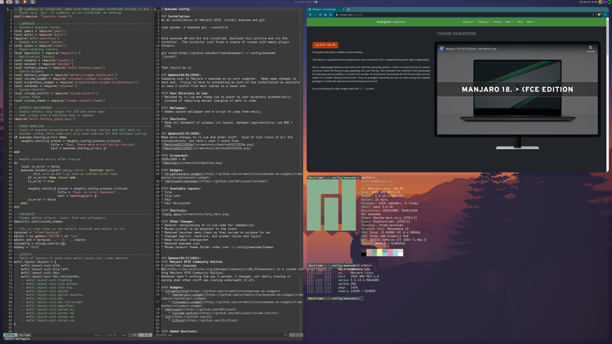
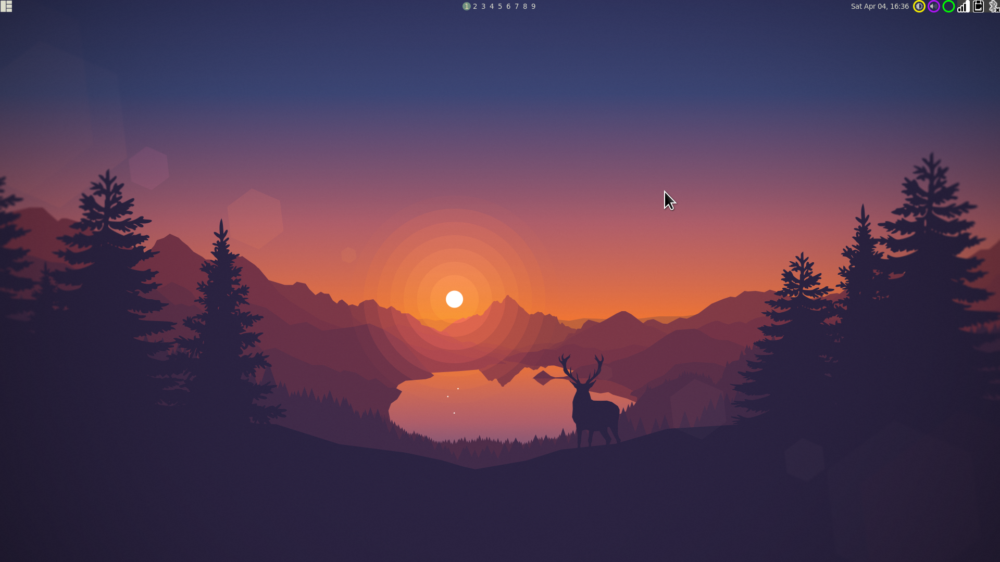
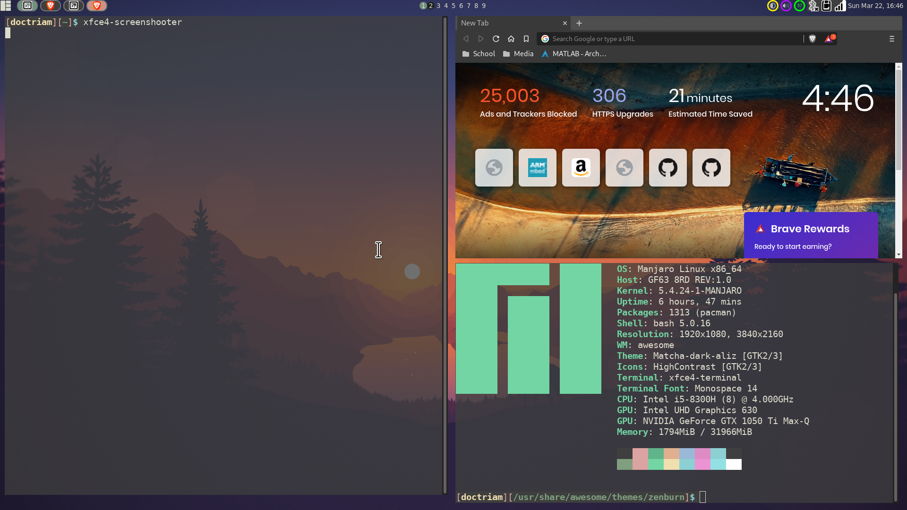
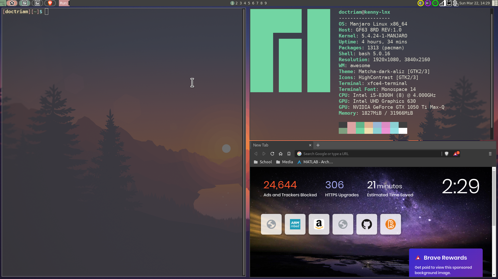
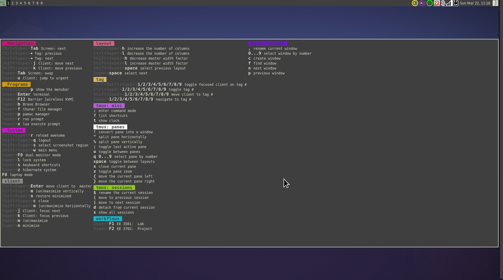

# Awesome Config



### Installation:
On an installation of Manjaro XFCE, install awesome and git:
```
sudo pacman -S awesome git --noconfirm
```

Once Awesome WM and Git are installed, download this profile and run the
installer.  The installer just fixes a couple of issues with empty plugin
folders:
```
git clone https://github.com/doctriam/awesomerc ~/.config/awesome
./install
```

That should be it.

### Update(04/02/2020):
Swapping over to Manjaro + Awesome on my work computer.  Made some changes to
that end.  Trying to move to automating as much of the installation as possible
in case I switch from test laptop to a newer one.

#### User Directory in Lua:
* Recoded my rc.lua and theme.lua to point to user directory automatically
  instead of requiring manual changing of path in code.

#### Wallpaper:
* Added second wallpaper and a script to swap them easily

#### Shortcuts:
* Made all movement of windows (in layout, between tags/monitors) use MOD +
  CTRL

### Update(03/22/2020):
Made more changes to rc.lua and other stuff.  Kind of lost track of all the
customizations, but here's what I could find.



#### Screenshot:
1920x1080 + 4K


#### Widgets:
* [brightnessarc-widget](https://github.com/streetturtle/awesome-wm-widgets/tree/master/brightnessarc-widget)
* [deficient/calendar](https://github.com/deficient/calendar)

#### Available Layouts:
* Tile
* Tile Left
* Fair
* Fair Horizontal

#### Shortcuts:


#### Other Changes:
* General reorginazing of rc.lua code for readability
* Moved systray to be adjacent to the clock
* Removed launcher menu items as they served no purpose for me
* Changed taglist, tasklist, and prompt styles and layout
* Made titlebar transparent
* Removed Awesome icon
* Moved zenburn theme folder under user ~/.config/awesome/themes


### Update(03/17/2022):
#### Manjaro XFCE Community Edition
I installed [Awesome
WM](https://www.archlinux.org/packages/community/x86_64/awesome/) on a system running Manjaro XFCE Community Edition.
Whatever wasn't working the way I wanted, I changed, not really knowing or
caring what other stuff was running underneath it all.

#### Widgets:
* [streetturtle](https://github.com/streetturtle/awesome-wm-widgets)
    * [batteryarc-widget](https://github.com/streetturtle/awesome-wm-widgets/tree/master/batteryarc-widget)
    * [volumearc-widget](https://github.com/streetturtle/awesome-wm-widgets/tree/master/volumearc-widget)
* [deficient](https://github.com/deficient)
    * [volume-control](https://github.com/deficient/volume-control)
* [i3](https://github.com/i3)
    * [i3lock](https://github.com/i3/i3lock)


#### Added Shortcuts:
* Brave browser (MOD + b)
* Barrier wireless KVM (MOD + F12)
* pamac package manager (MOD + p)
* i3lock lockscreen (MOD + l)
* system hibernate (MOD + z)
* xfce4-screenshooter (MOD + Shift + s)
* laptop monitor switch (F8): single monitor, auto-sized
* dual-monitor mode (MOD + F8): laptop monitor & 3840x2160
* custom scripts for school

#### Autostart Programs:
* polkit-gnome-authentication-agent-1: for pamac authentication
* nm-applet: wifi system tray icon
* xfce4-clipman: screenshot copy and paste
* xcompmgr -C: for terminal transparency
* blueman-applet: bluetooth system tray icon

#### Other Changes:
* Changed terminal to xfce4-terminal
* Tried to change editor to vim.  Not sure if it worked.
